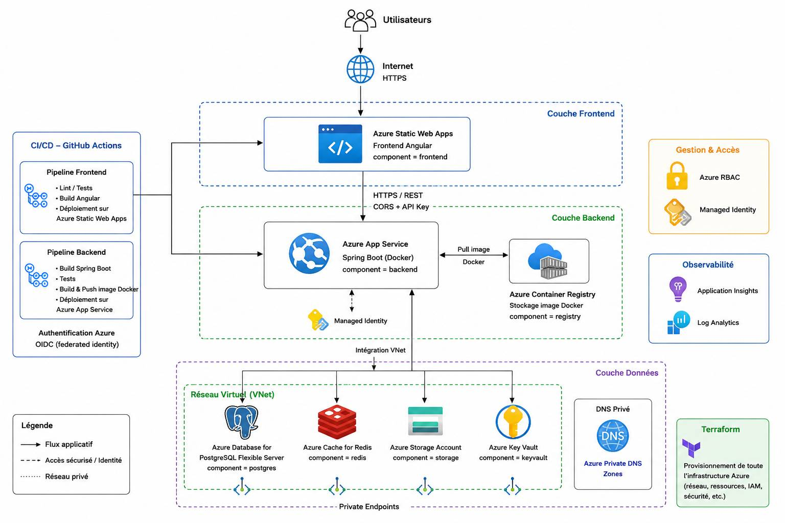

# Architecture Azure Quiz

## 1. Vue générale

L'application **Azure Quiz** repose sur une architecture Azure basée principalement sur des services managés.

L'infrastructure est provisionnée avec **Terraform** et les déploiements applicatifs sont automatisés avec **GitHub Actions**.

L'architecture sépare trois parties principales :

- le frontend Angular ;
- le backend Spring Boot ;
- les services de données et de sécurité Azure.



---

## 2. Frontend

Le frontend est développé avec **Angular** et hébergé dans **Azure Static Web Apps**.

Il constitue le point d'entrée public de l'application et communique avec le backend en HTTPS via une API REST.

```text
Utilisateur
    |
    | HTTPS
    v
Azure Static Web Apps
    |
    | HTTPS / REST
    v
Azure App Service
```

L'accès au backend depuis le frontend est contrôlé par :

- une configuration CORS limitée à l'origine du frontend ;
- une clé API applicative.

L'adresse de la Static Web App est récupérée automatiquement par Terraform et transmise au backend avec la variable :

`FRONTEND_URL`

Cela évite de coder en dur l'adresse du frontend.

---

## 3. Backend

Le backend est développé avec **Java Spring Boot**.

Il est construit sous forme d'image Docker puis exécuté dans **Azure App Service**.

L'image Docker est stockée dans **Azure Container Registry (ACR)**.

```text
Code Spring Boot
       |
       v
  Image Docker
       |
       v
Azure Container Registry
       |
       v
Azure App Service
```

L'App Service utilise une **Managed Identity** pour accéder aux ressources Azure autorisées.

Il utilise également une **VNet Integration** pour communiquer avec les services Azure privés.

---

## 4. Réseau

L'infrastructure utilise un **Azure Virtual Network (VNet)** afin de sécuriser les communications entre le backend et les services de données.

Le backend App Service est connecté au réseau grâce à la VNet Integration.

Les services concernés utilisent des mécanismes réseau privés tels que les sous-réseaux, Private Endpoints et Private DNS lorsque cela est nécessaire.

L'objectif est de réduire l'exposition publique des services internes.

```text
                 Azure App Service
                        |
                 VNet Integration
                        |
                        v
              +-------------------+
              |       VNet        |
              |                   |
              | PostgreSQL        |
              | Redis             |
              | Storage           |
              | Key Vault         |
              +-------------------+
```

---

## 5. PostgreSQL

**Azure Database for PostgreSQL Flexible Server** est utilisé comme base de données principale.

Le backend récupère ses informations de connexion depuis Azure Key Vault.

Les secrets associés comprennent notamment :

- `postgres-username` ;
- `postgres-password` ;
- `postgres-host` ;
- `postgres-jdbc-url`.

L'accès public à PostgreSQL est désactivé afin de privilégier les communications via le réseau Azure.

---

## 6. Redis

**Azure Managed Redis** est utilisé comme système de cache.

Le backend communique avec Redis depuis son environnement Azure.

Les informations sensibles nécessaires à cette connexion sont gérées de manière sécurisée et ne sont pas stockées directement dans le code source.

---

## 7. Storage Account

Un **Azure Storage Account** est utilisé pour les besoins de stockage de l'application.

La configuration impose notamment :

- HTTPS ;
- TLS 1.2 minimum ;
- des contrôles réseau adaptés à l'architecture.

L'App Service dispose des autorisations nécessaires pour accéder au stockage.

---

## 8. Azure Key Vault

**Azure Key Vault** centralise les secrets nécessaires à l'application.

Il contient notamment :

- les identifiants PostgreSQL ;
- l'URL JDBC ;
- les informations nécessaires à Redis ;
- la clé API du backend.

L'application accède à ces secrets grâce à son identité managée et aux autorisations **Azure RBAC**.

Les secrets ne sont donc pas stockés directement dans le code source.

---

## 9. Azure Container Registry

**Azure Container Registry (ACR)** stocke les images Docker du backend.

Le fonctionnement général est :

```text
GitHub Actions
      |
      | Build Docker
      v
Azure Container Registry
      |
      | Pull
      v
Azure App Service
```

Le pipeline backend construit l'image, la publie dans ACR puis configure le déploiement de l'App Service.

---

## 10. Identités et RBAC

L'architecture utilise les mécanismes d'identité Azure afin de limiter l'utilisation de secrets permanents.

L'App Service possède une **System Assigned Managed Identity**.

Des rôles Azure RBAC lui permettent d'accéder uniquement aux ressources nécessaires, notamment :

- Key Vault ;
- Storage Account ;
- Azure Container Registry.

Cette approche permet de contrôler précisément les permissions accordées au backend.

---

## 11. Infrastructure Terraform

Terraform est la source de vérité pour l'infrastructure Azure.

L'infrastructure est divisée en plusieurs modules :

```text
starter/terraform/
├── main.tf
├── variables.tf
├── outputs.tf
└── modules/
    ├── network/
    ├── static-web-app/
    ├── app-service/
    ├── container-registry/
    ├── postgres/
    ├── redis/
    ├── storage/
    └── keyvault/
```

Terraform est responsable notamment de :

- la création des ressources Azure ;
- la configuration réseau ;
- les identités managées ;
- les rôles RBAC ;
- les tags ;
- la configuration des services ;
- les relations entre les différents composants.

---

## 12. CI/CD

Les pipelines CI/CD sont exécutés avec **GitHub Actions**.

### Infrastructure

Le pipeline Terraform réalise notamment :

```text
terraform fmt
      |
terraform validate
      |
terraform plan
      |
terraform apply
```

L'application de l'infrastructure est contrôlée afin d'éviter les déploiements Terraform non souhaités.

### Backend

Le pipeline backend réalise :

```text
Build Maven
    |
Tests
    |
Contrôles de sécurité
    |
Build Docker
    |
Push ACR
    |
Deploy App Service
```

### Frontend

Le pipeline frontend réalise :

```text
Installation npm
    |
Lint / Tests
    |
Contrôles de sécurité
    |
Build Angular
    |
Deploy Static Web Apps
```

---

## 13. Authentification OIDC

GitHub Actions utilise **OpenID Connect (OIDC)** pour s'authentifier auprès d'Azure.

Le principe est :

```text
GitHub Actions
      |
      | OIDC
      v
Microsoft Entra ID
      |
      | Autorisation
      v
Azure
```

Cette solution permet d'éviter de stocker un secret permanent de Service Principal dans GitHub.

---

## 14. Tags Azure

Les ressources Terraform utilisent des tags communs :

```text
owner       = aicha-conteneur
project     = azuretech
environment = dev
managed_by  = terraform
component   = <composant>
```

Le tag `component` permet de distinguer les ressources :

- `frontend` ;
- `backend` ;
- `registry` ;
- `postgres` ;
- `redis` ;
- `storage` ;
- `keyvault`.

Ces tags facilitent également la recherche des ressources depuis les pipelines CI/CD.

---

## 15. Flux général de l'application

Le fonctionnement global peut être résumé ainsi :

```text
                         Utilisateur
                              |
                            HTTPS
                              |
                              v
                   Azure Static Web Apps
                      Frontend Angular
                              |
                       HTTPS / REST
                      CORS + API Key
                              |
                              v
                     Azure App Service
                  Spring Boot + Docker
                       /          \
                      /            \
                     v              v
                   ACR       VNet Integration
                                  |
                    +-------------+-------------+
                    |             |             |
                    v             v             v
                PostgreSQL      Redis        Storage
                                  |
                                  v
                              Key Vault
```

---

## 16. Principes de sécurité

L'architecture applique plusieurs mécanismes de sécurité :

- HTTPS pour les communications ;
- TLS 1.2 minimum sur les services concernés ;
- Azure Key Vault pour les secrets ;
- Managed Identity ;
- Azure RBAC ;
- VNet Integration ;
- accès privé aux services concernés ;
- CORS limité au frontend ;
- clé API pour protéger le backend ;
- OIDC entre GitHub Actions et Azure.

---

## 17. Décisions d'architecture

Les choix importants ne sont pas détaillés dans ce document mais dans les ADR :

```text
docs/adr/
├── ADR-001-choix-services-manages.md
├── ADR-002-securite-reseau.md
└── ADR-003-cicd.md
```

Ce document décrit **comment l'architecture est organisée**.

Les ADR expliquent **pourquoi les principaux choix d'architecture ont été réalisés**.
